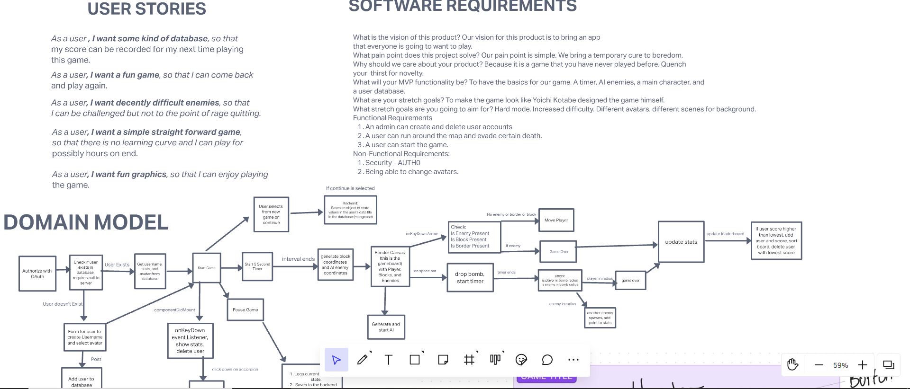
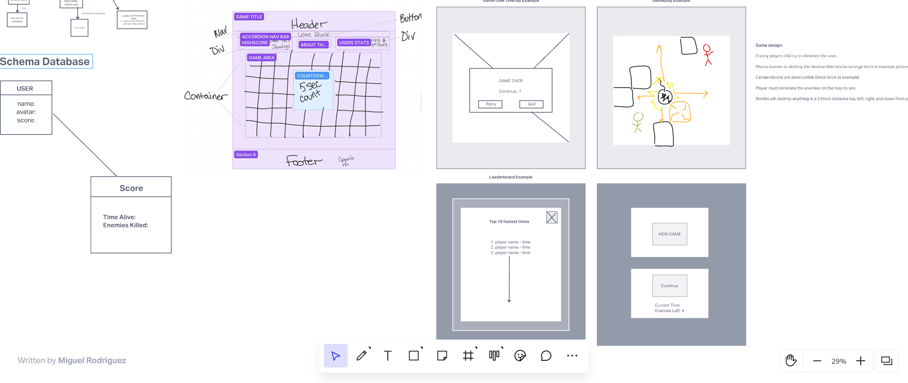

# Gridsplosion Frontend Server

**Author**: [Miguel Rodriguez](https://github.com/m11gz), [David Tusia](https://github.com/dftjr), [Brooke Heck](https://github.com/BrookeHeck)

**Version**: 1.0.5

 

## Overview
<!-- Provide a high level overview of what this application is and why you are building it, beyond the fact that it's an assignment for this class. (i.e. What's your problem domain?) -->

This app replicates the style of a classic NES game called bomerman! The point it to try to eliminate all the enemy blocks without eliminating yourself!

 

## Getting Started
<!-- What are the steps that a user must take in order to build this app on their own machine and get it running? -->

**User must take the following steps:**

### Initial Local Repository Pull
**STEP 1:** Go to the https://gridsplosion.netlify.app link, thats it! Have fun!

 

## Architecture
<!-- Provide a detailed description of the application design. What technologies (languages, libraries, etc) you're using, and any other relevant design information. -->

- Javascript 
- HTML
- CSS
- REACT
- NETLIFY
- HEROKU
- MongoDB
- Mongoose

 

## Change Log
<!-- Use this area to document the iterative changes made to your application as each feature is successfully implemented. Use time stamps. Here's an example:

01-01-2021 4:59pm - Application now has a fully-functional express server, with a GET route for the location resource. -->

09-06-2022 1:00pm - Initial setup complete, ready to code! Backend and frontend setup.

09-07-2022 10:00pm - App displays gameboard. Player movement and collisions added.

09-08-2022 10:00pm - Enemy AI movement and collisions added. Startgame and endgame modals added. Bomb drop added.

09-09-2022 10:00pm - Startgame removed, endgame shows leaderboard. API adds the random destructable blocks. All collisions working!

 

## Credit and Collaborations
<!-- Give credit (and a link) to other people or resources that helped you build this application. -->
Examples of canvas utility and grid structures: https://www.youtube.com/watch?v=yP5DKzriqXA&t=5869s

Examples of AI waypoints and targeting: https://www.youtube.com/watch?v=C4_iRLlPNFc&t=4600s

Basic reserach: https://developer.mozilla.org/en-US/

Reference material: Previous projects done by memebers of the team, code challenges

 

# TEAM CODE OF CONDUCT

<<<<<<< HEAD

=======

>>>>>>> cb2136e65d56ce1f8ffd062a7101bdbf27b14dc2
